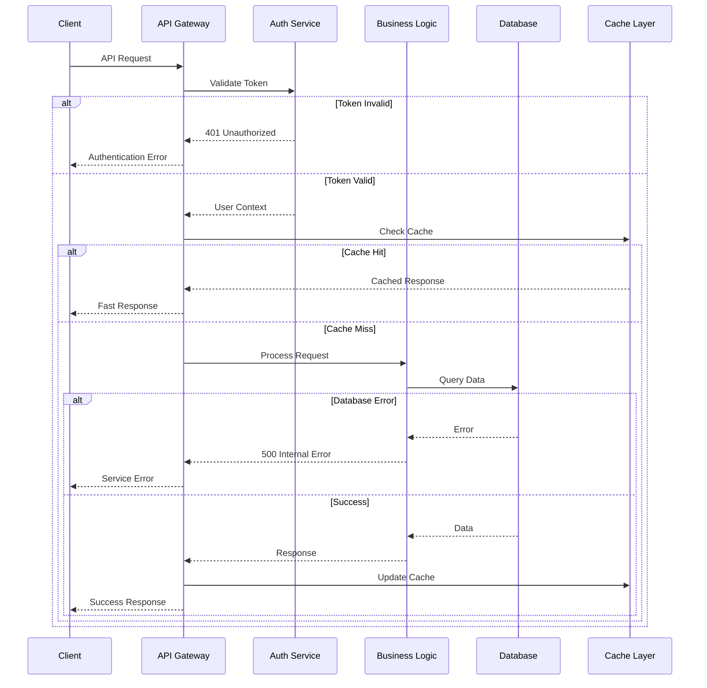
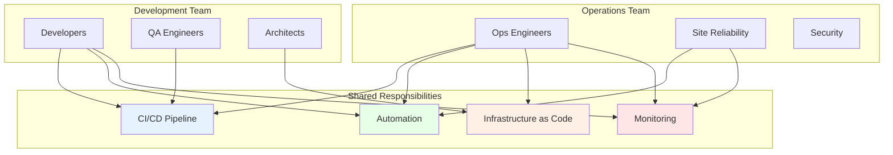
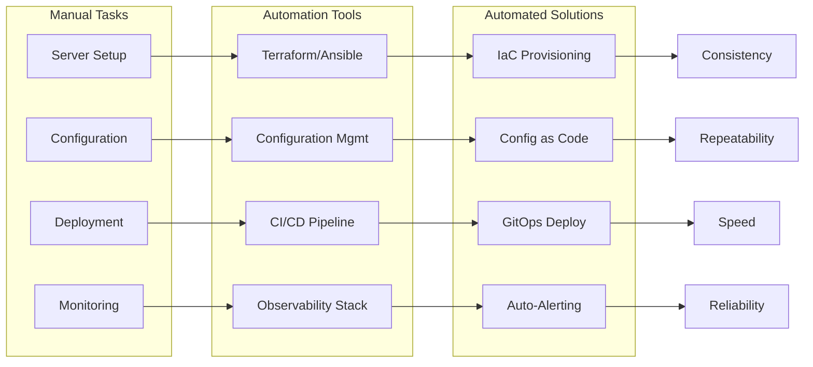

# API Workflow and DevOps Collaboration Diagrams

## API Request/Response Cycle with Error Handling

```mermaid
sequenceDiagram
    participant Client
    participant Gateway as API Gateway
    participant Auth as Auth Service
    participant Service as Business Logic
    participant DB as Database
    participant Cache as Cache Layer
    
    Client->>Gateway: API Request
    Gateway->>Auth: Validate Token
    
    alt Token Invalid
        Auth-->>Gateway: 401 Unauthorized
        Gateway-->>Client: Authentication Error
    else Token Valid
        Auth-->>Gateway: User Context
        Gateway->>Cache: Check Cache
        
        alt Cache Hit
            Cache-->>Gateway: Cached Response
            Gateway-->>Client: Fast Response
        else Cache Miss
            Gateway->>Service: Process Request
            Service->>DB: Query Data
            
            alt Database Error
                DB-->>Service: Error
                Service-->>Gateway: 500 Internal Error
                Gateway-->>Client: Service Error
            else Success
                DB-->>Service: Data
                Service-->>Gateway: Response
                Gateway->>Cache: Update Cache
                Gateway-->>Client: Success Response
            end
        end
    end
```

## DevOps Collaboration Model

```mermaid
graph TB
    subgraph "Development Team"
        Dev[Developers]
        QA[QA Engineers]
        Arch[Architects]
    end
    
    subgraph "Operations Team"
        Ops[Ops Engineers]
        SRE[Site Reliability]
        Sec[Security]
    end
    
    subgraph "Shared Responsibilities"
        CI[CI/CD Pipeline]
        Monitor[Monitoring]
        Auto[Automation]
        IaC[Infrastructure as Code]
    end
    
    Dev --> CI
    QA --> CI
    Ops --> CI
    
    Dev --> Auto
    Ops --> Auto
    SRE --> Auto
    
    Arch --> IaC
    Ops --> IaC
    
    SRE --> Monitor
    Ops --> Monitor
    Dev --> Monitor
    
    style CI fill:#e6f3ff
    style Monitor fill:#ffe6e6
    style Auto fill:#e6ffe6
    style IaC fill:#fff0e6
```

## Infrastructure Automation Process

```mermaid
flowchart LR
    subgraph "Manual Tasks"
        M1[Server Setup]
        M2[Configuration]
        M3[Deployment]
        M4[Monitoring]
    end
    
    subgraph "Automation Tools"
        T1[Terraform/Ansible]
        T2[Configuration Mgmt]
        T3[CI/CD Pipeline]
        T4[Observability Stack]
    end
    
    subgraph "Automated Solutions"
        A1[IaC Provisioning]
        A2[Config as Code]
        A3[GitOps Deploy]
        A4[Auto-Alerting]
    end
    
    M1 --> T1 --> A1
    M2 --> T2 --> A2
    M3 --> T3 --> A3
    M4 --> T4 --> A4
    
    A1 --> Benefits1[Consistency]
    A2 --> Benefits2[Repeatability]
    A3 --> Benefits3[Speed]
    A4 --> Benefits4[Reliability]
```