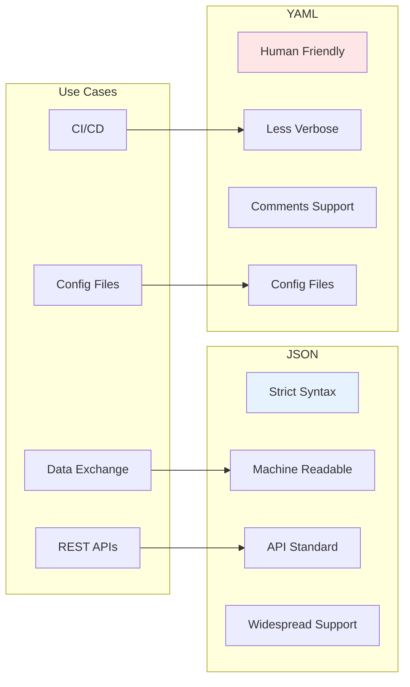
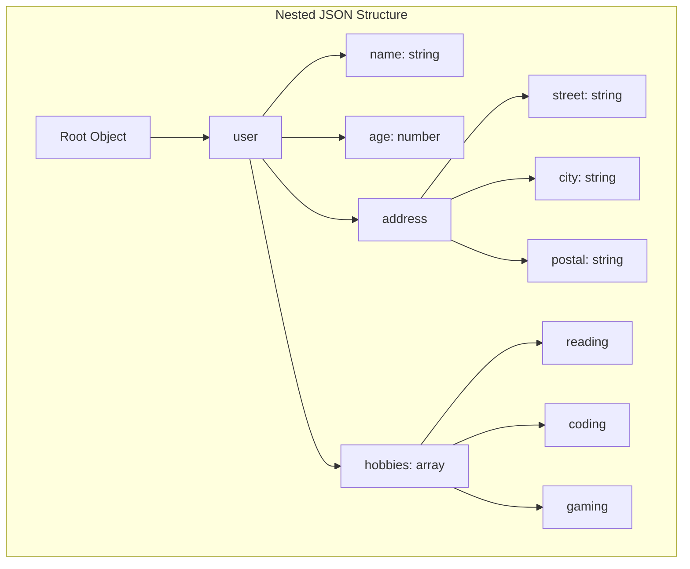
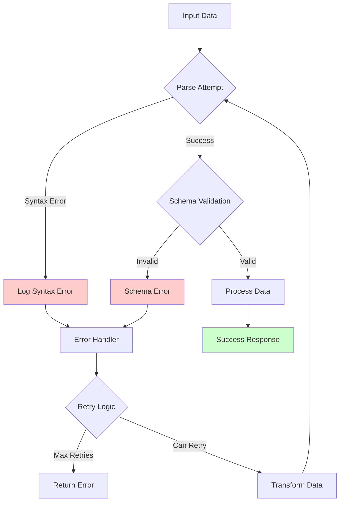
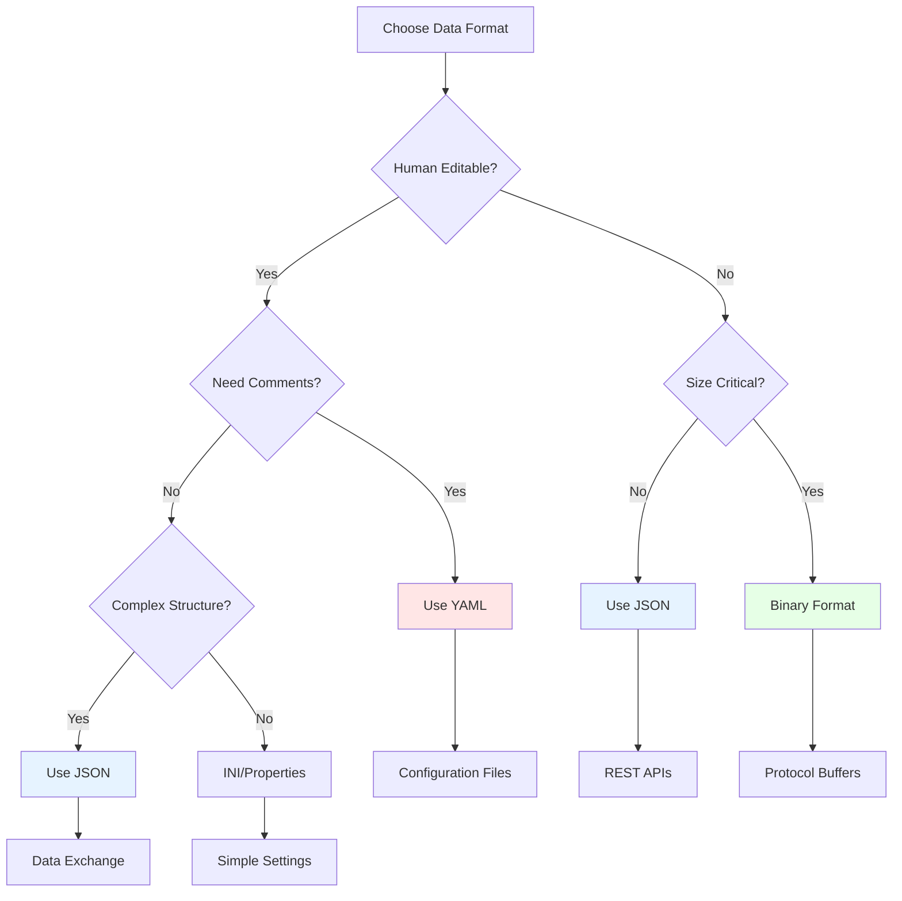

# Data Description Languages Visualization

## JSON vs YAML Comparison Chart

```mermaid
graph LR
    subgraph "JSON"
        J1[Strict Syntax]
        J2[Machine Readable]
        J3[API Standard]
        J4[Widespread Support]
    end
    
    subgraph "YAML"
        Y1[Human Friendly]
        Y2[Less Verbose]
        Y3[Comments Support]
        Y4[Config Files]
    end
    
    subgraph "Use Cases"
        UC1[REST APIs] --> J3
        UC2[Config Files] --> Y4
        UC3[CI/CD] --> Y2
        UC4[Data Exchange] --> J2
    end
    
    style J1 fill:#e6f3ff
    style Y1 fill:#ffe6e6
```

## Data Structure Hierarchy Diagrams

```mermaid
graph TD
    subgraph "Nested JSON Structure"
        Root[Root Object]
        Root --> User[user]
        User --> Name[name: string]
        User --> Age[age: number]
        User --> Address[address]
        Address --> Street[street: string]
        Address --> City[city: string]
        Address --> Postal[postal: string]
        User --> Hobbies[hobbies: array]
        Hobbies --> H1[reading]
        Hobbies --> H2[coding]
        Hobbies --> H3[gaming]
    end
```

## Parsing Error Flow

```mermaid
flowchart TD
    Start[Input Data] --> Parse{Parse Attempt}
    
    Parse -->|Success| Validate{Schema Validation}
    Parse -->|Syntax Error| SyntaxErr[Log Syntax Error]
    
    Validate -->|Valid| Process[Process Data]
    Validate -->|Invalid| SchemaErr[Schema Error]
    
    SyntaxErr --> ErrorHandler[Error Handler]
    SchemaErr --> ErrorHandler
    
    ErrorHandler --> Retry{Retry Logic}
    Retry -->|Max Retries| Fail[Return Error]
    Retry -->|Can Retry| Transform[Transform Data]
    Transform --> Parse
    
    Process --> Success[Success Response]
    
    style SyntaxErr fill:#ffcccc
    style SchemaErr fill:#ffcccc
    style Success fill:#ccffcc
```

## Data Format Selection Decision Tree

```mermaid
flowchart TD
    Start[Choose Data Format] --> Q1{Human Editable?}
    
    Q1 -->|Yes| Q2{Need Comments?}
    Q1 -->|No| Q3{Size Critical?}
    
    Q2 -->|Yes| YAML[Use YAML]
    Q2 -->|No| Q4{Complex Structure?}
    
    Q3 -->|Yes| Binary[Binary Format]
    Q3 -->|No| JSON1[Use JSON]
    
    Q4 -->|Yes| JSON2[Use JSON]
    Q4 -->|No| INI[INI/Properties]
    
    YAML --> Config[Configuration Files]
    JSON1 --> API[REST APIs]
    JSON2 --> Data[Data Exchange]
    Binary --> Protocol[Protocol Buffers]
    INI --> Simple[Simple Settings]
    
    style YAML fill:#ffe6e6
    style JSON1 fill:#e6f3ff
    style JSON2 fill:#e6f3ff
    style Binary fill:#e6ffe6
```