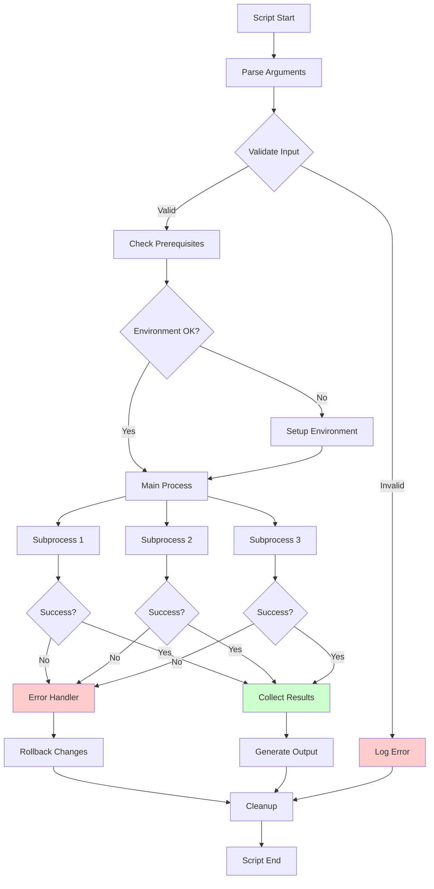
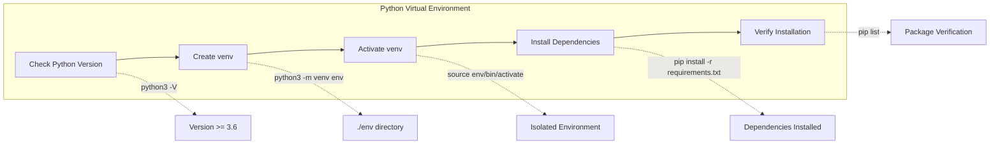
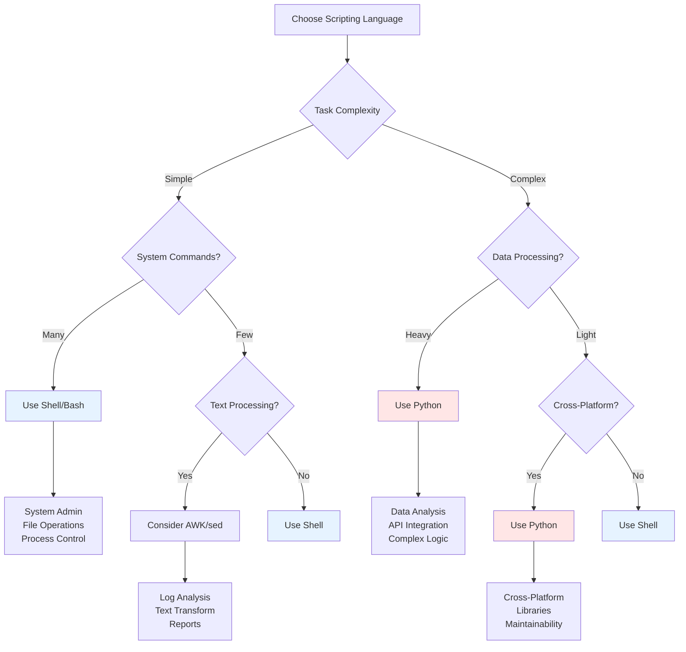
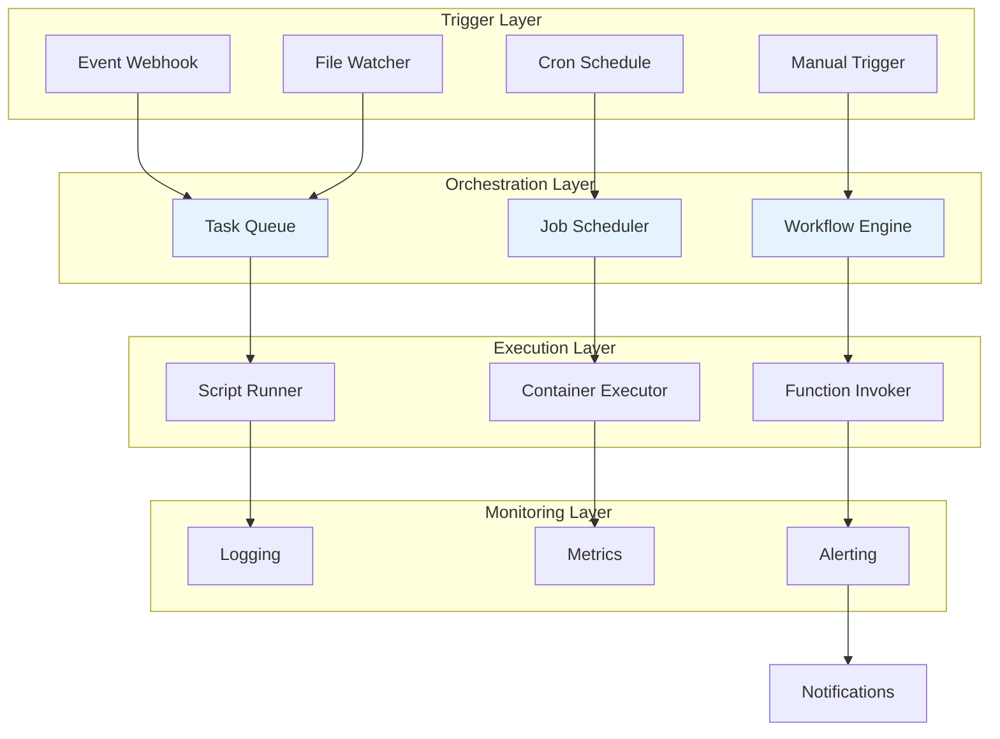

# Scripting Automation Diagrams

## Script Execution Flow

```mermaid
flowchart TD
    Start[Script Start] --> Input[Parse Arguments]
    Input --> Validate{Validate Input}
    
    Validate -->|Invalid| Error1[Log Error]
    Validate -->|Valid| Check[Check Prerequisites]
    
    Check --> Env{Environment OK?}
    Env -->|No| Setup[Setup Environment]
    Env -->|Yes| Main[Main Process]
    
    Setup --> Main
    
    Main --> Sub1[Subprocess 1]
    Main --> Sub2[Subprocess 2]
    Main --> Sub3[Subprocess 3]
    
    Sub1 --> Result1{Success?}
    Sub2 --> Result2{Success?}
    Sub3 --> Result3{Success?}
    
    Result1 -->|No| ErrorHandler[Error Handler]
    Result2 -->|No| ErrorHandler
    Result3 -->|No| ErrorHandler
    
    Result1 -->|Yes| Collect[Collect Results]
    Result2 -->|Yes| Collect
    Result3 -->|Yes| Collect
    
    ErrorHandler --> Rollback[Rollback Changes]
    Rollback --> Cleanup
    
    Collect --> Output[Generate Output]
    Output --> Cleanup[Cleanup]
    Error1 --> Cleanup
    
    Cleanup --> End[Script End]
    
    style Error1 fill:#ffcccc
    style ErrorHandler fill:#ffcccc
    style Collect fill:#ccffcc
```

## Virtual Environment Setup Process

```mermaid
graph LR
    subgraph "Python Virtual Environment"
        Step1[Check Python Version]
        Step2[Create venv]
        Step3[Activate venv]
        Step4[Install Dependencies]
        Step5[Verify Installation]
    end
    
    Step1 --> Step2
    Step2 --> Step3
    Step3 --> Step4
    Step4 --> Step5
    
    Step1 -.->|python3 -V| Check1[Version >= 3.6]
    Step2 -.->|python3 -m venv env| Create[./env directory]
    Step3 -.->|source env/bin/activate| Active[Isolated Environment]
    Step4 -.->|pip install -r requirements.txt| Deps[Dependencies Installed]
    Step5 -.->|pip list| Verify[Package Verification]
```

## Shell vs Python Decision Tree

```mermaid
flowchart TD
    Start[Choose Scripting Language] --> Q1{Task Complexity}
    
    Q1 -->|Simple| Q2{System Commands?}
    Q1 -->|Complex| Q3{Data Processing?}
    
    Q2 -->|Many| Shell[Use Shell/Bash]
    Q2 -->|Few| Q4{Text Processing?}
    
    Q3 -->|Heavy| Python1[Use Python]
    Q3 -->|Light| Q5{Cross-Platform?}
    
    Q4 -->|Yes| AWK[Consider AWK/sed]
    Q4 -->|No| Shell2[Use Shell]
    
    Q5 -->|Yes| Python2[Use Python]
    Q5 -->|No| Shell3[Use Shell]
    
    Shell --> UseCases1[System Admin<br/>File Operations<br/>Process Control]
    Python1 --> UseCases2[Data Analysis<br/>API Integration<br/>Complex Logic]
    Python2 --> UseCases3[Cross-Platform<br/>Libraries<br/>Maintainability]
    AWK --> UseCases4[Log Analysis<br/>Text Transform<br/>Reports]
    
    style Shell fill:#e6f3ff
    style Shell2 fill:#e6f3ff
    style Shell3 fill:#e6f3ff
    style Python1 fill:#ffe6e6
    style Python2 fill:#ffe6e6
```

## Automation Pipeline Architecture

```mermaid
graph TB
    subgraph "Trigger Layer"
        T1[Cron Schedule]
        T2[Event Webhook]
        T3[Manual Trigger]
        T4[File Watcher]
    end
    
    subgraph "Orchestration Layer"
        O1[Task Queue]
        O2[Job Scheduler]
        O3[Workflow Engine]
    end
    
    subgraph "Execution Layer"
        E1[Script Runner]
        E2[Container Executor]
        E3[Function Invoker]
    end
    
    subgraph "Monitoring Layer"
        M1[Logging]
        M2[Metrics]
        M3[Alerting]
    end
    
    T1 --> O2
    T2 --> O1
    T3 --> O3
    T4 --> O1
    
    O1 --> E1
    O2 --> E2
    O3 --> E3
    
    E1 --> M1
    E2 --> M2
    E3 --> M3
    
    M3 --> Notify[Notifications]
    
    style O1 fill:#e6f3ff
    style O2 fill:#e6f3ff
    style O3 fill:#e6f3ff
```