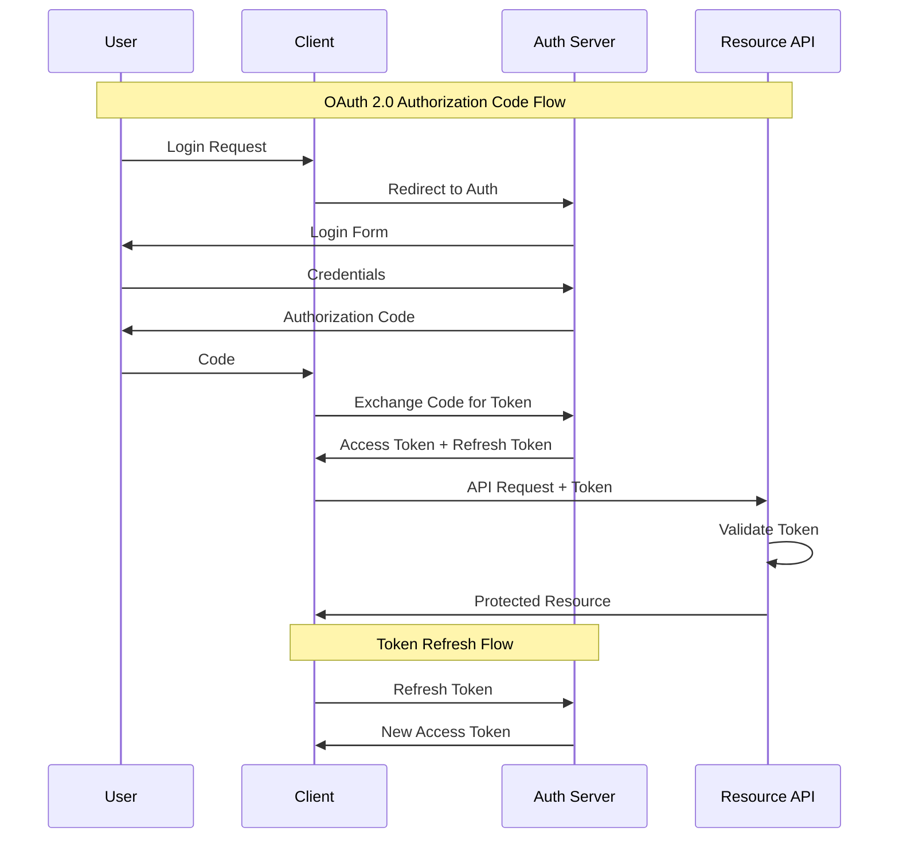
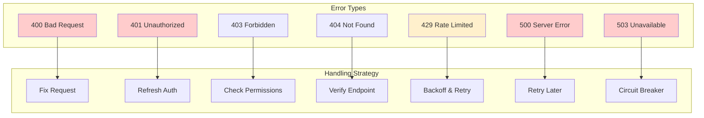
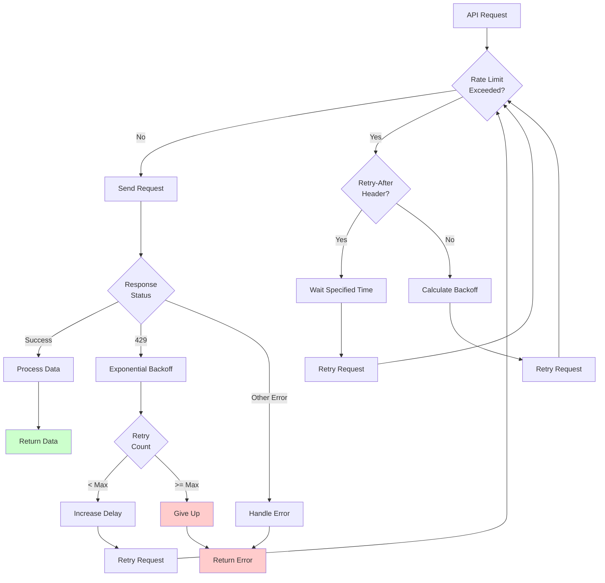
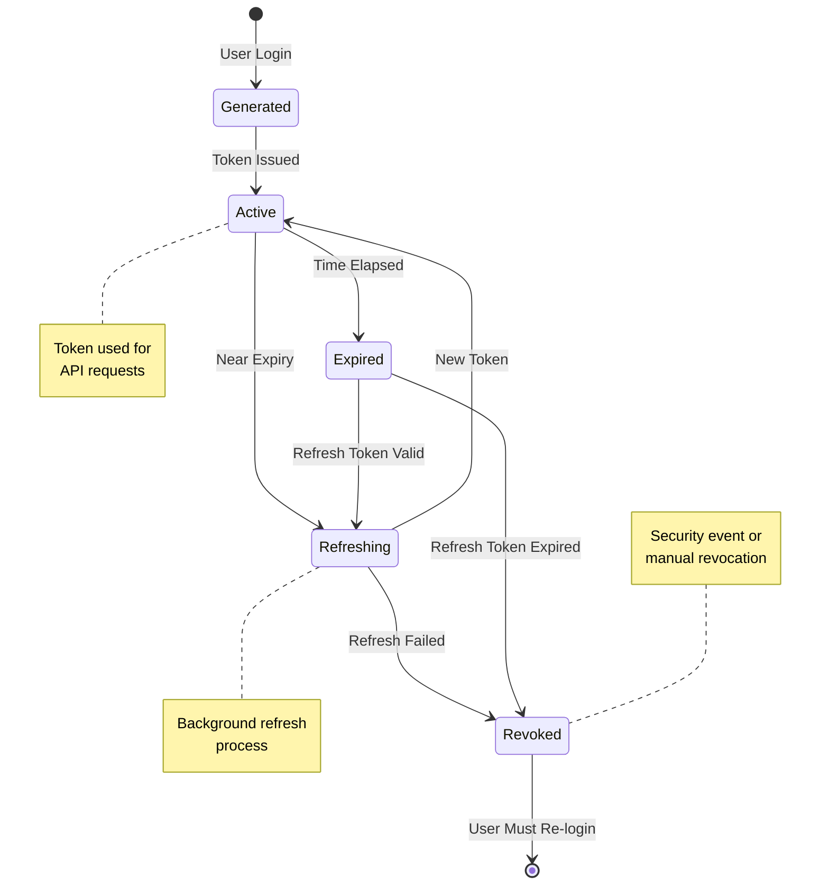
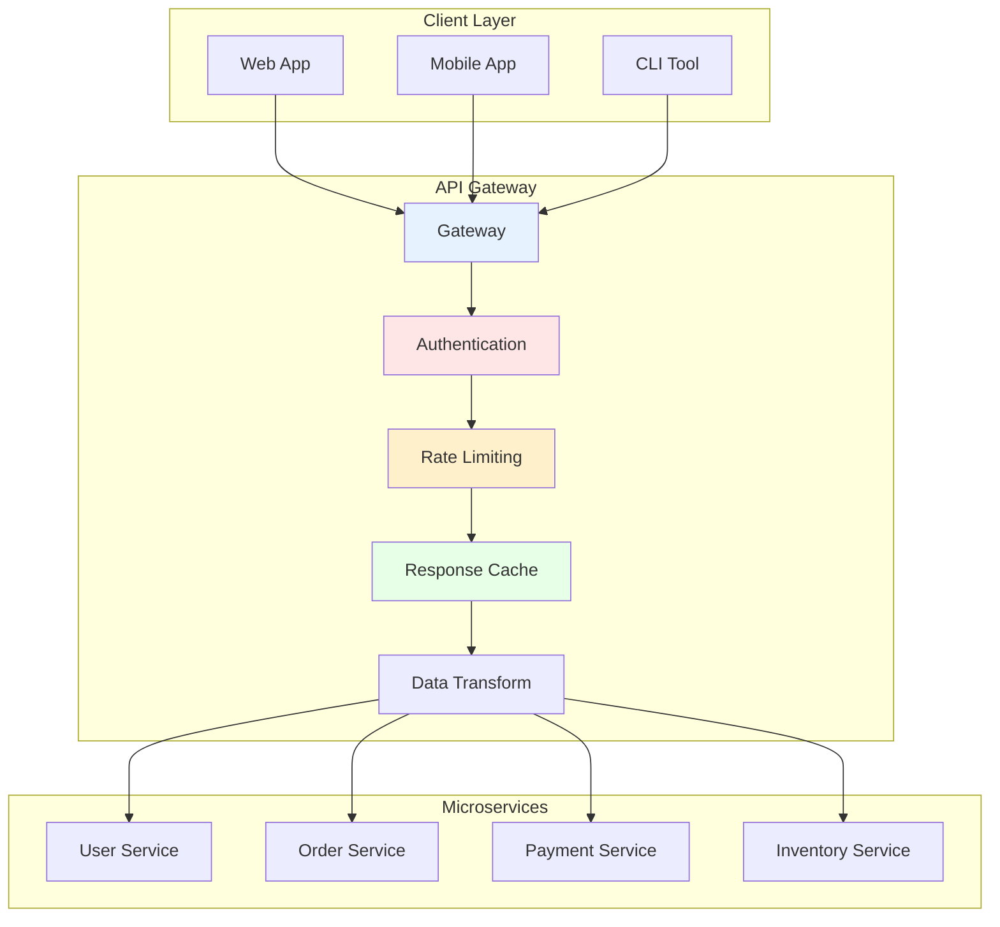

# API Integration Diagrams

## Authentication Flow Diagrams

```mermaid
sequenceDiagram
    participant User
    participant Client
    participant AuthServer as Auth Server
    participant API as Resource API
    
    Note over User,API: OAuth 2.0 Authorization Code Flow
    
    User->>Client: Login Request
    Client->>AuthServer: Redirect to Auth
    AuthServer->>User: Login Form
    User->>AuthServer: Credentials
    AuthServer->>User: Authorization Code
    User->>Client: Code
    Client->>AuthServer: Exchange Code for Token
    AuthServer->>Client: Access Token + Refresh Token
    Client->>API: API Request + Token
    API->>API: Validate Token
    API->>Client: Protected Resource
    
    Note over Client,AuthServer: Token Refresh Flow
    Client->>AuthServer: Refresh Token
    AuthServer->>Client: New Access Token
```

## API Error Handling Matrix

```mermaid
graph TB
    subgraph "Error Types"
        E400[400 Bad Request]
        E401[401 Unauthorized]
        E403[403 Forbidden]
        E404[404 Not Found]
        E429[429 Rate Limited]
        E500[500 Server Error]
        E503[503 Unavailable]
    end
    
    subgraph "Handling Strategy"
        H1[Fix Request]
        H2[Refresh Auth]
        H3[Check Permissions]
        H4[Verify Endpoint]
        H5[Backoff & Retry]
        H6[Retry Later]
        H7[Circuit Breaker]
    end
    
    E400 --> H1
    E401 --> H2
    E403 --> H3
    E404 --> H4
    E429 --> H5
    E500 --> H6
    E503 --> H7
    
    style E400 fill:#ffcccc
    style E401 fill:#ffcccc
    style E429 fill:#fff0cc
    style E500 fill:#ffcccc
    style E503 fill:#ffcccc
```

## Rate Limiting Strategy Diagram

```mermaid
flowchart TD
    Start[API Request] --> Check{Rate Limit<br/>Exceeded?}
    
    Check -->|No| Send[Send Request]
    Check -->|Yes| Wait{Retry-After<br/>Header?}
    
    Send --> Response{Response<br/>Status}
    
    Response -->|Success| Process[Process Data]
    Response -->|429| Backoff[Exponential Backoff]
    Response -->|Other Error| Error[Handle Error]
    
    Wait -->|Yes| Delay1[Wait Specified Time]
    Wait -->|No| Delay2[Calculate Backoff]
    
    Delay1 --> Retry1[Retry Request]
    Delay2 --> Retry2[Retry Request]
    Backoff --> Counter{Retry<br/>Count}
    
    Counter -->|< Max| Increase[Increase Delay]
    Counter -->|>= Max| Fail[Give Up]
    
    Increase --> Retry3[Retry Request]
    
    Retry1 --> Check
    Retry2 --> Check
    Retry3 --> Check
    
    Process --> Success[Return Data]
    Fail --> ErrorReturn[Return Error]
    Error --> ErrorReturn
    
    style Success fill:#ccffcc
    style Fail fill:#ffcccc
    style ErrorReturn fill:#ffcccc
```

## JWT Token Lifecycle

```mermaid
stateDiagram-v2
    [*] --> Generated: User Login
    Generated --> Active: Token Issued
    Active --> Refreshing: Near Expiry
    Active --> Expired: Time Elapsed
    Refreshing --> Active: New Token
    Refreshing --> Revoked: Refresh Failed
    Expired --> Refreshing: Refresh Token Valid
    Expired --> Revoked: Refresh Token Expired
    Revoked --> [*]: User Must Re-login
    
    note right of Active
        Token used for
        API requests
    end note
    
    note right of Refreshing
        Background refresh
        process
    end note
    
    note left of Revoked
        Security event or
        manual revocation
    end note
```

## API Gateway Architecture

```mermaid
graph TB
    subgraph "Client Layer"
        Web[Web App]
        Mobile[Mobile App]
        CLI[CLI Tool]
    end
    
    subgraph "API Gateway"
        Gateway[Gateway]
        Auth[Authentication]
        RateLimit[Rate Limiting]
        Cache[Response Cache]
        Transform[Data Transform]
    end
    
    subgraph "Microservices"
        Service1[User Service]
        Service2[Order Service]
        Service3[Payment Service]
        Service4[Inventory Service]
    end
    
    Web --> Gateway
    Mobile --> Gateway
    CLI --> Gateway
    
    Gateway --> Auth
    Auth --> RateLimit
    RateLimit --> Cache
    Cache --> Transform
    
    Transform --> Service1
    Transform --> Service2
    Transform --> Service3
    Transform --> Service4
    
    style Gateway fill:#e6f3ff
    style Auth fill:#ffe6e6
    style RateLimit fill:#fff0cc
    style Cache fill:#e6ffe6
```